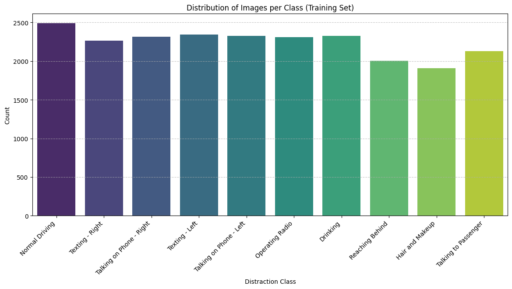
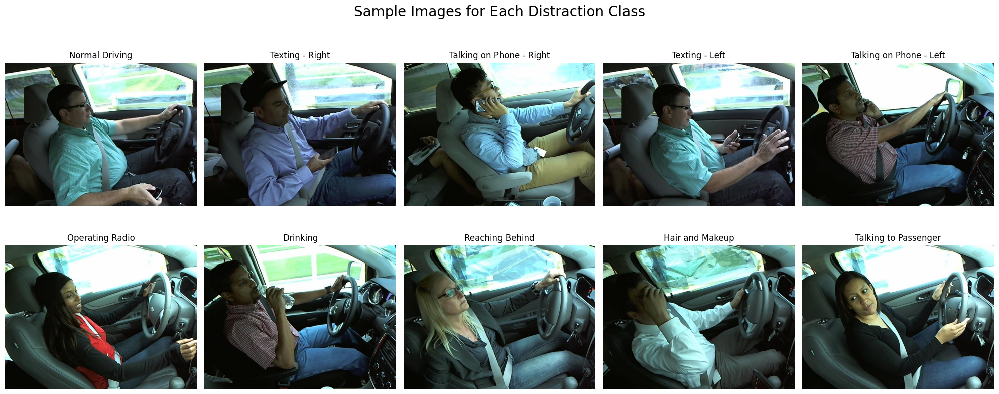
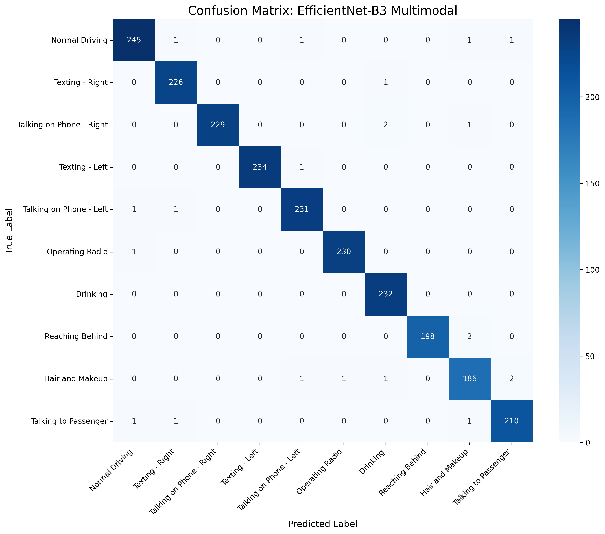

# Distracted Driver Detection System

A production-ready deep learning system for real-time driver distraction detection using multimodal fusion architecture combining **EfficientNet-B3** visual encoding with **YOLOv8-Pose** skeletal feature extraction, achieving **99.15% validation accuracy** on the State Farm dataset.

---

## Team

- Mohamed Elessawy
- Hesham Yehia
- Mohamd Abdelmohsen
- Ali Abdelmonam

---

## Overview

This project implements a state-of-the-art driver behavior analysis system that detects 10 distinct driving states through a dual-stream neural network architecture. The system processes both visual information and driver skeletal geometry to provide robust, real-time predictions suitable for safety-critical applications.

**Key Performance Metrics:**
- Validation Accuracy: **99.15%**
- Architecture: Multimodal Fusion (EfficientNet-B3 + YOLOv8-Pose)
- Inference Speed: 10-20 FPS (GPU), 2-5 FPS (CPU)
- Model Size: ~45 MB

---

## Project Structure

```
DL-Final-Project-Distracted-Driver-Detection/
│
├── assets/                          # Documentation & metrics
│   ├── class_distribution.png
│   ├── classification_report_evaluation.txt
│   ├── confusion_matrix_evaluation.png
│   ├── sample.png
│   └── training_progress.log
│
├── experiments/                     # Model evaluation scripts
│   ├── cnn_baseline_test.py
│   ├── transfer_learning_test.py    # EfficientNet evaluation (BEST)
│   └── multimodal_test.py
│
├── models/                          # Pre-trained weights
│   ├── best_model_CNN.pth
│   ├── best_model_Effnet.pth       # Best model (EfficientNet-B3)
│   ├── best_model_MM.pth
│   └── yolov8n-pose.pt
│
├── notebooks/                       # Development & analysis
│   └── distracted_driver_detection.ipynb  # Complete training pipeline
│
├── src/                             # Application code
│   ├── app.py                      # Streamlit web interface
│   └── inference.py                # Model classes & utilities
│
├── test_samples/                    # Test images for Streamlit app
│   └── *.jpg                       # Driver images
│
├── .gitignore
├── README.md
└── requirements.txt
```

---

## Dataset

This project uses the **State Farm Distracted Driver Detection** dataset from Kaggle:
- **Total Images:** 22,424 training samples  
- **Classes:** 10 distraction categories (details shown below)
- **Resolution:** 640×480 pixels  
- **Variations:** Multiple angles, lighting conditions per driver

📊 [Download from Kaggle](https://www.kaggle.com/competitions/state-farm-distracted-driver-detection/data)

### Class Distribution


*Distribution of training samples across the 10 distraction classes.*

### Sample Classes


*All 10 distraction classes from the dataset: Normal Driving, Texting-Right/Left, Phone-Right/Left, Operating Radio, Drinking, Reaching Behind, Hair & Makeup, and Talking to Passenger.*

---

## Architecture

### Multimodal Fusion Design

The system employs a **dual-branch neural network** that processes both visual and skeletal information:

```
Input Driver Image (256x256)
    │
    ├─→ [EfficientNet-B3 CNN Branch]
    │      └─→ Feature Extraction (1536-dim)
    │
    └─→ [YOLOv8-Pose Detection Branch]
           └─→ 17 Keypoints Extraction
           └─→ MLP Processing (17×3 → 64-dim)
    │
    ├─→ [Fusion Layer]
    │      └─→ Concatenate (1536 + 64 = 1600-dim)
    │
    └─→ [Classification Head]
           └─→ Dense Layers (1600 → 512 → 256 → 10 classes)
```

### Component Details

1. **EfficientNet-B3 Visual Encoder**
   - Efficient architecture with minimal parameters
   - Extract 1536-dimensional visual features
   - Adapted for grayscale driver images (256×256)
   - Dropout regularization to prevent overfitting

2. **YOLOv8-Nano Pose Detector**
   - Detects 17 skeletal keypoints per driver
   - Normalized coordinates (rotation/scale invariant)
   - Provides geometric context: hand position, head angle, body posture
   - MLP branch: 51-dim keypoints → 64-dim embedding

3. **Fusion Classifier**
   - Concatenates visual and pose embeddings
   - Multi-layer perceptron with BatchNorm & Dropout
   - 10-way softmax for classification
   - Learns complementary feature interactions

---

## Getting Started

### Quick Start (Recommended: Kaggle)

For fastest setup with free GPU access, use [Kaggle Notebooks](https://www.kaggle.com/code):
1. Upload this repository to Kaggle
2. Enable GPU accelerator in notebook settings
3. Run training/evaluation scripts directly

### Installation (Local)

1. Clone the repository
   ```bash
   git clone https://github.com/mohamed-elessawy/DL-Final-Project-Distracted-Driver-Detection
   cd DL-Final-Project-Distracted-Driver-Detection
   ```

2. **Requirements**: Python 3.8+, PyTorch 2.2.0+, GPU recommended (CPU supported)

3. Install dependencies
   ```bash
   pip install -r requirements.txt
   ```

---

## Usage

### Running the Streamlit App

```bash
cd src
streamlit run app.py
```

The app launches at `http://localhost:8501` with four input modes:

#### Mode 1: Image Upload
- Upload single or multiple JPG/PNG images
- Gallery slider for batch navigation
- Real-time classification with confidence scores
- Green: Safe driving | Red: Distracted

#### Mode 2: Camera Snapshot
- Capture image directly from webcam
- Instant classification
- Single-shot inference

#### Mode 3: Video Upload
- Process pre-recorded MP4/AVI files
- Frame-by-frame analysis with FPS metrics
- Full-screen video playback

#### Mode 4: Live Camera Feed
- Real-time webcam stream processing
- Continuous FPS calculation
- Toggle-controlled activation

### Model Evaluation Scripts

Test individual models:

```bash
# Test baseline CNN
python experiments/cnn_baseline_test.py

# Test multimodal variant
python experiments/multimodal_test.py

# Test best model (EfficientNet-B3) - RECOMMENDED
python experiments/transfer_learning_test.py
```


---

## Model Performance

**Best Model: EfficientNet-B3**  
Validation Accuracy: **99.15%**

Detailed metrics: [assets/classification_report_evaluation.txt](assets/classification_report_evaluation.txt)  


*Confusion matrix showing classification performance across all 10 classes.*

Training progress: [assets/training_progress.log](assets/training_progress.log)

Watch live demo: [Google Drive Demo Video](https://drive.google.com/file/d/1Kp_2FwBfI-51b2YSOS4HAh3nZy6scC4m/view)

---

## Development

### Training Pipeline

Complete training implementation in [notebooks/distracted_driver_detection.ipynb](notebooks/distracted_driver_detection.ipynb):
- Data loading and preprocessing
- Exploratory data analysis
- EfficientNet-B3 model architecture
- Training loops with validation
- Inference testing
- Results analysis
